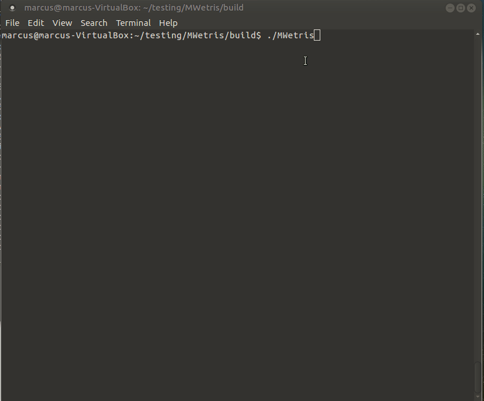

MWetris - Simple and fun tetris game
======
- [About](#about)
- [Requirements](#requirements)
  - [Dependencies](#dependencies)
  - [Building](#building)  
- [Simulate ai](#simulate-ai)
- [Running the game](#running-the-game)
- [License](#license)

## About
The project MWetris is a Tetris clone with network capabilities. You 
can play up to 4 human players on one computer and up to 4 computer opponents.

The project is using CMake to generate the environment specific development 
tools. E.g. Visual Studio solution (Windows) or makefile (Unix). See more 
at http://www.cmake.org/.

Current release is MWetris 1.0 which uses OpenGl 1.1 and SDL. Is tested to work under windows, but should work under linux too (no binary available though!).

Next version is MWetris 2.x which uses OpenGl 2.1 and SDL2.


## Requirements
### Dependencies
For windows there are a self contained zip for the binary for MWetris 1.0 (https://github.com/mwthinker/Tetris/releases/latest). At this time no binary version exists of  the 2.x version.

SDL2 (at least 2.0.3, http://www.libsdl.org/), SDL2_image, SDL2_ttf, SDL2_mixer
and SDL2_net. And the application uses GLEW (http://glew.sourceforge.net/) to
load OpengGl 2.1.

Code from the json 3.1.2 project (https://nlohmann.github.io/json/) is used to provide json support.

For non Windows OS, ncurses library is used for the console tetris version.

On Ubuntu 16.04:
```
sudo apt update
sudo apt install git cmake build-essential libsdl2-dev libsdl2-ttf-dev libsdl2-net-dev libsdl2-image-dev libsdl2-mixer-dev libglew-dev libncurses5-dev
```
Or use https://github.com/mwthinker/Scripts/blob/master/bash/build_tetris_simulator which installs all dependencies. It then compiles and start the console version of MWetris.

### Building
At least version 3.0 of CMake must be used. Make sure all dependencies and a native 
compiler are installed. The dependencies must also be recognized by CMAKE.

On Windows using Visual Studio 2017 the enviroment variable SDL2DIR can be used to point to SDL2_image, SDL2_ttf, SDL2_mixer and SDL2_net and GLEW. In order for cmake to recognize all needed dependencies, all runtime dll-files must be in the current path.

On Ubuntu 16.04:
```
git clone https://github.com/mwthinker/Tetris.git
cd Tetris
git checkout develop
git submodule update --init --recursive
cd build
# Creates build files for tetrisEngineTest and MWetris
cmake -D "TetrisEngineTest=1" ..
make
```

## Simulate ai
You can customize tetris.json, and change the ai used by the game.

To try out different ai value functions change the ai in the json file and start the game to see the result. Or try the TetrisEngineTest project, optional in the cmake file.

Print help.
```
TetrisEngineTest --help
```

Start the game and print each move by the ai with 500 ms delay.
```
TetrisEngineTest --delay 500
```

Simulate a ai game using a custom value function and showing the end result:
```
TetrisEngineTest -a "-2*rowHoles - 5*columnHoles - 1*rowSumHeight / (1 + rowHoles) - 2*blockMeanHeight"
```

## Running the game
Example of the window game version of MWetris 2.x.


The binary can be executed from the command line. And using flags to test different settings.


## License
The project is under the MIT license (see LICENSE.txt).
